  

  

## 🙋‍🔭♀️ Introducing Myself

Hello, I'm Amisha. A developer with a growing focus on Python, SQL, and AI/ML, alongside strong fundamentals in data structures & algorithms.

- Writing and solving problems using Python and C++
- Querying and working with data using SQL
- Exploring AI & machine learning concepts and projects
- Building end-to-end projects, including cross-generational knowledge sharing tools

## 📚 Projects

Welcome to my portfolio, where I showcase my projects.

## 🛠️ Tools

- Language: Python, SQL, C++
- Focus areas: AI & Machine Learning, Data Structures & Algorithms

## 👋 Connect with Me

- Email: amishakumari485@gmail.com
- GitHub: [@Amishaaaaa](https://github.com/Amishaaaaa)
